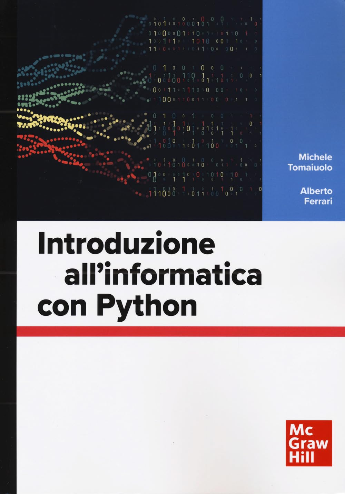

## Libro di testo

- [Catalogo McGraw-Hill](https://www.mheducation.it/9788838613586){:target="_blank"}
- [🛒 Amazon](https://www.amazon.it/dp/8838613583){:target="_blank"}

## Codice presente nel testo

- [▶️ Python playground](https://fondinfo.github.io/play), con esempi
- [g2d](g2d)
- [Database](https://fondinfo.github.io/database){:target="_blank"}
- [Web](web){:target="_blank"}
- [Data analysis](https://fondinfo.github.io/dataanalysis){:target="_blank"}
- [Soluzioni esercizi](soluzioni)

## Software

- [Termux](termux)
- [Thonny](https://thonny.org/)

## [Slide e lezioni](/slides)
